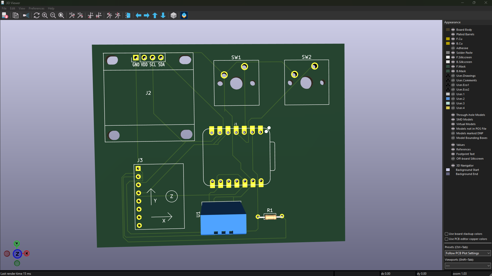

# Starbie

Starbie is a small, motion-controlled digital pet for a desk. The idea is pretty simple: build a compact little companion with a tiny display, sensors, buttons, and a custom PCB, then let the user interact with it through movement, environmental readings, and physical input.

This is my Week 1 Starbie build, made from scratch. The KiCad schematic and custom carrier PCB are complete, while hardware assembly and testing are still ahead. The firmware source is included too, but right now it's a hardware-independent foundation with the sensor, display, and pet-behavior code marked for implementation after hardware bring-up.

## How It Works

The XIAO ESP32-C3 is the main microcontroller. It handles the 3.3 V logic and reads the sensors and buttons, while the OLED is meant to show Starbie's face and future state information. Basically, it's the part that ties everything together.

| Component | Connection | Role |
| --- | --- | --- |
| J1 — Seeed Studio XIAO ESP32-C3 | Main controller | Processes inputs and drives the project |
| J2 — 0.96-inch 128x64 4-pin I2C OLED | SDA → D4 / GPIO6; SCL → D5 / GPIO7; 3V3; GND | Display for Starbie's face and planned information |
| J3 — MPU6050 | SDA → D4 / GPIO6; SCL → D5 / GPIO7; 3V3; GND | Motion sensing |
| U1 — DHT11 | DHT11 data → D1 / GPIO3; 3V3; GND | Temperature and humidity sensing |
| SW1 | Button 1 → D2 / GPIO4; active-low input to GND | Physical user input |
| SW2 | Button 2 → D3 / GPIO5; active-low input to GND | Physical user input |
| R1 — 10 kΩ resistor | DHT11 data circuit | Pull-up resistor used with the DHT11 data connection |

The main signal flow is pretty straightforward:

```text
MPU6050 detects movement
        ↓
XIAO ESP32-C3 processes the input
        ↓
OLED can display Starbie's state
```

The DHT11 sends temperature and humidity readings to the XIAO, which can then pass information to the OLED. The buttons provide physical input to the XIAO too. The responses are still planned for now: the firmware has the pin definitions and program structure, but its display, sensor-reading, pet-state, menu, and animation functions still contain TODOs and haven't been tested on assembled hardware.

## Hardware and Design

The schematic was designed in KiCad, and the PCB was designed as a custom Starbie carrier PCB. The board has been routed, with 0 unrouted connections reported during the KiCad design check. DRC was run, and the actual electrical errors and unconnected items were resolved.

These are the design files:

- [KiCad project](hardware/kicad/Starbie.kicad_pro)
- [KiCad schematic](hardware/kicad/Starbie.kicad_sch)
- [PCB layout](hardware/kicad/Starbie.kicad_pcb)

Manufacturing outputs are included in [hardware/manufacturing/gerbers/](hardware/manufacturing/gerbers/), including the Gerber layers, Gerber job file, and both drill files. The physical PCB isn't assembled or tested yet.

## Photos & Screenshots

### PCB layout



*Completed Starbie PCB layout screenshot — this is what the finished board layout looks like right now.*

### Schematic

**Schematic screenshot:** Not available in the repository yet. The source schematic is available at [hardware/kicad/Starbie.kicad_sch](hardware/kicad/Starbie.kicad_sch), and a screenshot can be added here later.

### 3D model

**3D PCB render:** Not available in the repository yet. The source PCB is available at [hardware/kicad/Starbie.kicad_pcb](hardware/kicad/Starbie.kicad_pcb), so this section can get a render once one is available.

### Physical build

**Physical build:** Not assembled yet. This section will get real photos once the PCB and components are available.

## Wiring

Starbie uses a custom PCB, so the main component connections are captured in the KiCad schematic and PCB instead of being a loose hand-wired breadboard project.

No separate hand-wired wiring diagram is required for the current build; the electrical connections are documented in the [KiCad schematic](hardware/kicad/Starbie.kicad_sch) and [PCB layout](hardware/kicad/Starbie.kicad_pcb). The board does the wiring work here.

## Bill of Materials

Prices and links below come directly from [hardware/BOM/BOM.csv](hardware/BOM/BOM.csv). The PCB fabrication price is still `TBD` because the project doesn't specify a board house, order quantity, options, or shipping quote.

| Part | Qty | Purpose | Vendor | Price | Link |
| --- | ---: | --- | --- | ---: | --- |
| J1 — XIAO ESP32-C3 | 1 | Main microcontroller and USB-C board | Seeed Studio | $5.99 | [Product page](https://www.seeedstudio.com/Seeed-Studio-XIAO-ESP32C3-Pre-Soldered-p-6331.html) |
| J2 — 0.96-inch 128x64 OLED | 1 | I2C display / Starbie's face | Adafruit | $17.50 | [Product 326](https://www.adafruit.com/product/326) |
| J3 — MPU6050 breakout | 1 | Accelerometer and gyroscope | Adafruit | $12.95 | [Product 3886](https://www.adafruit.com/product/3886) |
| U1 — DHT11 module | 1 | Temperature and humidity sensing | DFRobot | $4.20 | [DFR0067](https://www.dfrobot.com/product-174.html) |
| SW1 — Omron B3F-1000 | 1 | Button 1 input | Omron | $0.35 | [Digi-Key listing](https://www.digikey.com/en/products/detail/aratas-formerly-omron-components/B3F-1000/33150) |
| SW2 — Omron B3F-1000 | 1 | Button 2 input | Omron | $0.35 | [Digi-Key listing](https://www.digikey.com/en/products/detail/aratas-formerly-omron-components/B3F-1000/33150) |
| R1 — 10 kΩ axial resistor | 1 | DHT11 data-circuit pull-up | Yageo | $0.10 | [CFR-25JB-52-10K](https://octopart.com/part/yageo-group/CFR-25JB-52-10K) |
| PCB1 — Custom Starbie PCB | 1 | Routed carrier PCB | TBD | TBD | — |

The switch rows use the Omron B3F-1000 named in the schematic and BOM. The verified PCB footprint is `Button_Switch_THT:SW_TH_Tactile_Omron_B3F-10xx`. Keeping the part and footprint aligned matters a lot here — tiny switches are not magically interchangeable just because they both have two switch states.

## Repository Structure

```text
.
├── README.md
├── hardware/
│   ├── kicad/                         KiCad project, schematic, and PCB
│   ├── manufacturing/gerbers/         Gerbers, Gerber job, and drill files
│   └── BOM/BOM.csv                    Bill of materials and supplier links
├── firmware/Starbie/Starbie.ino       Firmware foundation
├── assets/pcb-art/                    Project image assets
├── docs/                              Hardware, pinout, and project documentation
└── research/                          Component research
```

## Build Status and Next Steps

- PCB design: completed
- PCB routing: completed
- DRC: checked; actual electrical errors and unconnected items resolved
- Manufacturing files: generated
- BOM: prepared; PCB fabrication price remains TBD
- Firmware source: included; hardware-dependent behavior is not implemented or tested yet
- Physical assembly and testing: still pending

Next up:

1. Order the components and PCB.
2. Assemble the hardware.
3. Flash and test the firmware.
4. Test the OLED, MPU6050, DHT11, and buttons.
5. Photograph the completed physical build.
6. Update this README with real build photos and test results once they exist.

